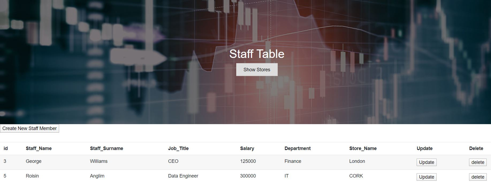

### Data Representation - Web Application Project 

#### Details of Repository 

This repository comprises of a web application that hosts staff and store details. The web application consumes a restful api. The restful api facilitates read,create,update and delete (CRUD) functions to be carried out on an SQL database.

#### Website 

The website is made up of two pages. The first page contains a staff table holding the staff's details.The update,create and delete buttons within the wedpage, enable the staffs details to be amended. Upon clicking on any of the labelled buttons,the staffs details are prompted. Upon submission, the selected function is called and both the sql database and the webpage are updated.

The second page consists of the store table. This contains deatils about the store locations. The update,create and delete buttons within the wedpage, enable the stores details to be amended. Upon clicking on any of the labelled buttons,the stores details are prompted. Upon submission, the selected function is called and both the sql database and the webpage are updated.

