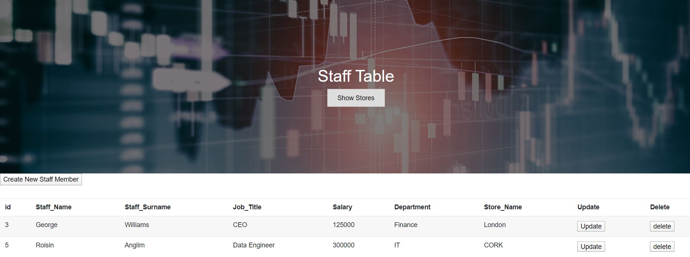

### Data Representation - Web Application Project 

#### Details of Repository 

This repository comprises of a web application that hosts staff and store details. The web application consumes a restful api. The restful api facilitates read,create,update and delete (CRUD) functions to be carried out on an SQL database.

#### Website 

The website is made up of two pages. The first page contains a staff table holding the staff's details.The update,create and delete buttons within the wedpage, enable the staffs details to be amended. Upon clicking on any of the labelled buttons,the staffs details are prompted. Once these details are submitted, the selected function is called and both the sql database and the webpage are updated. The show store button located in the centre of the page allows easy navigation to the stores table.

The second page consists of the store table. This contains details about the store locations. The update,create and delete buttons within the wedpage, enable the stores details to be amended. Upon clicking on any of the labelled buttons,the staffs details are prompted. Once these details are submitted, the selected function is called and both the sql database and the webpage are updated.

Both pages utilise a javascript contain method, to prompt the user prior to deleting information from the staff or store tables. 

